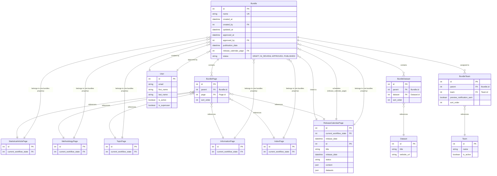
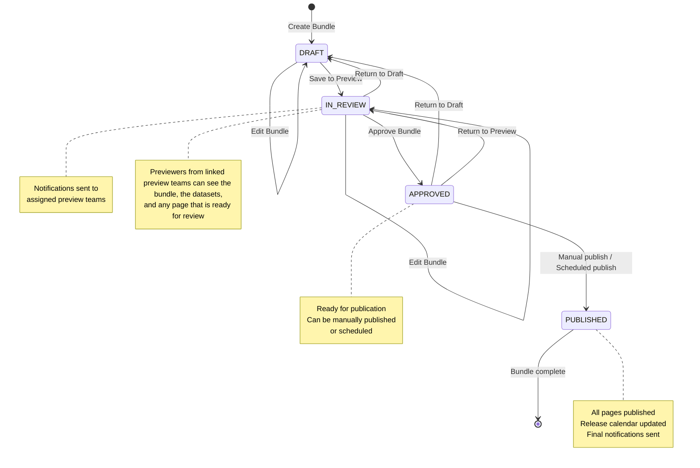
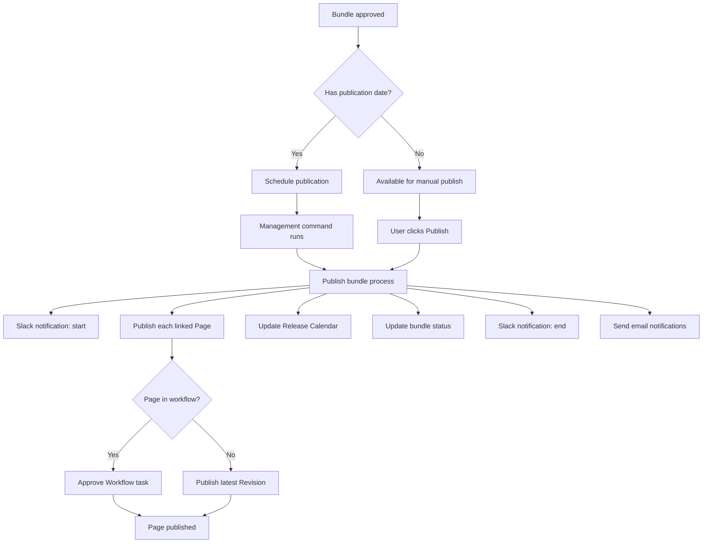

# Bundles

The bundles app is a feature that allows coordinated publishing of multiple pages and datasets as a single unit. And
controls the workflows around pre-publication.

## Table of Contents

-   [Overview](#overview)
-   [Architecture](#architecture)
-   [Models](#models)
-   [Bundle lifecycle](#bundle-lifecycle)
-   [Permissions & Security](#permissions--security)
-   [Notifications](#notifications)
-   [Management commands](#management-commands)
-   [UI Reference](#ui-reference)
-   [Troubleshooting](#troubleshooting)

## Overview

The bundles app orchestrates the publication of related content by grouping pages and datasets under one umbrella, giving access to them to with specific preview teams.
It provides a workflow that includes draft creation, review, approval, and scheduled publication phases.

### Features

-   Coordinated publishing - publish multiple pages and datasets simultaneously
-   Release Calendar integration - link bundles to release calendar pages
-   Scheduled publication - automatic publication at specified times
-   Workflow integration - approval workflow with status transitions, and integration with [Wagtail workflows](https://guide.wagtail.org/en-latest/how-to-guides/configure-workflows-for-moderation/)
-   Team-based previews - assign specific teams to preview bundles before publication
-   Notifications - email and Slack notifications for status changes

## Architecture

### Entity Relationship Diagram



### Bundle status flow



### Publication Process Flow



## Models

### `Bundle`

The main bundle model that orchestrates content publication.

Key properties:

-   `scheduled_publication_date`: Returns publication_date or release_calendar_page.release_date
-   `can_be_approved`: Whether bundle can be approved (all pages ready to publish)
-   `is_ready_to_be_published`: Whether bundle status is `APPROVED`
-   `can_be_manually_published`: Whether bundle can be published manually
-   Useful manager methods:
    -   `Bundle.objects.active()`: Returns bundles in `DRAFT`, `IN_REVIEW`, or `APPROVED` status
    -   `Bundle.objects.editable()`: Returns bundles in `DRAFT` or `IN_REVIEW` status
    -   `Bundle.objects.previewable()`: Returns bundles in `IN_REVIEW` or `APPROVED` status

### `BundlePage`

An [orderable inline model](https://docs.wagtail.org/en/stable/topics/pages.html) that links pages to bundles.

Bundle instances have access via the `bundled_pages` property.

### `BundleDataset`

An orderable inline model that links datasets (`cms.datasets.Dataset`) to bundles for Data API integration.

### `BundleTeam`

Assigns preview teams (`cms.teams.Team`) to bundles, and tracks whether the team has been notified about
being added to a bundle.

### `BundledPageMixin`

Mixin for page models that can be included in bundles. This mixin provides the reverse relationship functionality that allows pages to query their bundle membership.

**Reverse relationship details:**

-   `bundlepage_set` manager through the foreign key relationship
-   `bundles` property - use this to find all `Bundle` objects containing the page
-   `active_bundles` - returns a list of bundles, filtered to only DRAFT, IN_REVIEW, or APPROVED
-   `active_bundle` returns the single active bundle (enforced by business logic)
-   `in_active_bundle` provides boolean check for UI and validation logic
-   `get_lock()` overrides the lock mechanism Wagtail uses for the page editor when bundle is approved and ready to publish

## Bundle lifecycle

### Status definitions

### 1. Draft

-   Bundle created by authorized user
-   Pages and datasets can be added/removed
-   Preview teams can be assigned
-   Publication date or release calendar page can be set

### 2. In Review

-   Bundle moved to review status
-   Email notifications sent to assigned preview teams
-   Preview teams can access bundle inspection and page previews
-   Bundle can be edited or returned to draft

### 3. Approved

-   All bundled pages must be in "Ready to Publish" workflow state
-   Bundle approved by authorized user (different from creator)
-   Bundle locked from content changes
-   Available for manual publication or scheduled publication

### 4. Published

-   All bundled pages published simultaneously
-   Release calendar page updated (if linked)
-   Status changed to `PUBLISHED`
-   Final notifications sent to teams
-   Bundle becomes read-only. That is no more changes are allowed

| From status      | To status                                   | Note                                                                                                                                                                                                                                                                                                    |
| ---------------- | ------------------------------------------- | ------------------------------------------------------------------------------------------------------------------------------------------------------------------------------------------------------------------------------------------------------------------------------------------------------- |
| Draft            | Draft<br> In Preview                        |                                                                                                                                                                                                                                                                                                         |
| In Preview       | In Preview <br> Ready to publish <br> Draft | Note: a bundle can only go to “Ready to publish” if all linked pages are in the “Ready to publish” workflow step, and soon all linked datasets have a status of “Ready to publish” in the Dateset API                                                                                                   |
| Ready to publish | Draft <br> In Preview <br> Published\*      | When in “Ready to publish”, changes are disabled until the bundle goes back to “In preview” or “Draft” <br> A bundle will be marked as published automatically, if scheduled. <br> A bundle can be manually published if it was not scheduled, or it was but for some reason the scheduled task failed. |
| Published        | -                                           | Once published, no more changes can be made                                                                                                                                                                                                                                                             |

## Permissions & Security

### Permission Levels

#### Bundle Managers

Users with `add` or `change` bundle permissions:

-   Create, edit, approve bundles
-   View all bundles regardless of team assignment
-   Access all bundle pages in preview mode

#### Bundle Previewers

Users with `view` bundle permission:

-   View bundles assigned to their teams
-   Preview pages in `IN_REVIEW` or `APPROVED` bundles
-   Receive email notifications for assigned bundles

### Access considerations

-   Bundle creation requires an authenticated user with the relevant permissions
-   Page-level approval requires a different user than the last editor.
    Note: this was also the case for bundles, but it was deemed unnecessary, so the logic was removed.
-   Team-based access control for preview functionality
-   Bundle form validation prevents unauthorized status changes
-   Page editing is locked when the linked bundle is ready to publish
-   The `user_can_manage_bundles()` and `user_can_preview_bundle()` permission utility methods are used throughout the business logic

## Notifications

### Email

A couple of notification emails are sent when the bundle

-   moves to "in review" (`IN_REVIEW` status)
    -   Notifies all active users in assigned preview teams via `bundle_in_review_email`
-   is published
    -   Notifies all active users in assigned preview teams via `bundle_published_email`

Templates at `cms/bundles/templates/bundles/notification_emails/`

### Slack

Slack notifications are sent (when configured) on:

-   Status change, using `notify_slack_of_status_change`
-   Publication, using `notify_slack_of_publication_start` and `notify_slack_of_publish_end`

Configuration:

-   Requires `SLACK_NOTIFICATIONS_WEBHOOK_URL` in settings
-   Sends rich attachments with bundle details
-   Error handling with logging on webhook failures

## Management commands

### `publish_bundles`

Automated command for scheduled bundle publication.

```bash
python manage.py publish_bundles [--dry-run] [--include-future SECONDS]
```

Features:

-   Publishes all approved bundles with past/current publication dates
-   `--dry-run`: Show bundles that would be published without publishing
-   `--include-future`: Include bundles scheduled within specified seconds
-   Uses scheduler for precise timing of future publications
-   Atomic transactions with error handling and logging

Process:

1. Query approved bundles with publication dates ≤ current time
2. Schedule each bundle for publication at exact time
3. For each bundle: publish pages, update release calendar, send notifications
4. Update bundle status to `PUBLISHED`

### `publish_scheduled_without_bundles`

Handles publication of individual scheduled pages not in bundles.

```bash
python manage.py publish_scheduled_without_bundles [--dry-run]
```

## UI reference

### Bundle ViewSet

Uses [ModelViewSet](https://docs.wagtail.org/en/stable/reference/viewsets.html#modelviewset) to provide bespoke UI and business logic for bundles.

-   `/admin/bundles/` - List bundles
-   `/admin/bundles/create/` - Create bundle
-   `/admin/bundles/{id}/edit/` - Edit bundle
    Includes a few custom actions

    -   `action-save-to-preview`: Move to `IN_REVIEW` status
    -   `action-approve`: Move to `APPROVED` status
    -   `action-return-to-draft`: Return to `DRAFT` status
    -   `action-publish`: Manually publish bundle

-   `/admin/bundles/{id}/inspect/` - Inspect bundle
    Makes use of the `get_FIELD_NAME_display_value` "magic" method to tweak how the various field values are displayed. The big ones are the list of pages and datasets.

### Bundle Views

-   `/admin/bundles/add/{page_to_add_id}>/` - A FormView that allows adding a page to an active bundle
-   `/admin/bundles/{id}/preview/{page_id}/` - A custom TemplateView to allow previewing pages in a bundle, with appropriate checks
-   `/admin/bundles/preview/{bundle_id}/release-calendar/` - A custom TemplateView that allows previewing the linked Release Calendar page as if the bundle was published

### Signal handlers

The bundle app makes use of signal handlers to send email notifications to preview teams

-   when the bundle moves to `IN_REVIEW`
-   when a team is assigned to a bundle that is `IN_REVIEW`
-   when the bundle is published

## Integration points

### Wagtail admin

-   Admin interface
    -   [custom viewsets](https://docs.wagtail.org/en/stable/reference/viewsets.html#modelviewset) with bundle-specific actions; choosers; page explorer buttons
    -   [dedicated panels](https://docs.wagtail.org/en/stable/reference/panels.html#module-wagtail.admin.panels) such as `BundleStatusPanel`, `BundleNotePanel` or `BundleMultipleChooserPanel`
-   Workflow - checks page workflow states before bundle approval
-   Search - bundles are indexed for admin search
-   Permissions - add/edit/inspect permissions and user group roles are used for controlling access

### Release Calendar

-   Bundles can link to release calendar pages
-   Publication automatically updates linked calendar entries
-   Bundle content serialized into calendar page content fields
-   Dataset information synchronized with calendar

### Teams

-   Preview teams assigned to bundles
-   Team membership determines notification recipients
-   Active team status affects notification delivery

### Workflow

-   Pages must be in "Ready to Publish" state for bundle approval
-   Page locks when bundle ready to publish
-   Bundle publication completes workflow tasks

### Logging

Key logged events:

-   `publishing_bundle` - the bundle publication started
-   `published_bundle` - the bundle publication finished
-   `publish_failed` - the bundle publication failed
-   `publish_page_failed` - the publication of an individual page in the bundle failed

As well as Wagtail [audit log](https://docs.wagtail.org/en/stable/extending/audit_log.html#audit-log) events:

-   `bundles.update_status` - the bundle status has changed
-   `bundles.approve` - the bundle was approved
-   `bundles.preview` - a page in the bundle was previewed
-   `bundles.preview.attempt` - a user attempted to preview a page in a bundle that they do not have access to

### Related Documentation

-   Wagtail
    -   [ModelViewSet](https://docs.wagtail.org/en/stable/reference/viewsets.html#modelviewset)
    -   [Panels](https://docs.wagtail.org/en/stable/reference/panels.html#module-wagtail.admin.panels)
    -   [Workflows](https://docs.wagtail.org/en/stable/reference/models.html#workflowmixin)
    -   [Audit log](https://docs.wagtail.org/en/stable/extending/audit_log.html#audit-log)
        -   [Hook to register actions](https://docs.wagtail.org/en/stable/reference/hooks.html#register-log-actions)
    -   [Panels](https://docs.wagtail.org/en/stable/reference/panels.html)
-   [Django signals](https://docs.djangoproject.com/en/stable/topics/signals/)
